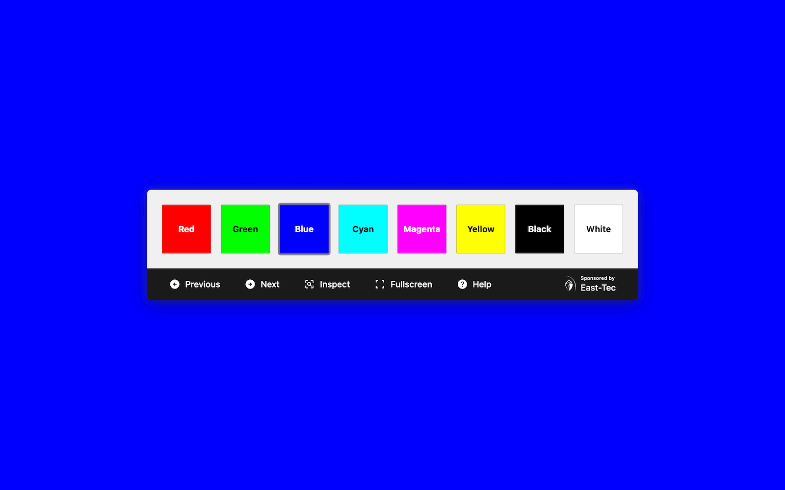

# InjuredPixels

[](https://github.com/aurelitec/injuredpixels/releases)
[](https://injuredpixels.aurelitec.com/)
[](LICENSE)
[](https://github.com/aurelitec/injuredpixels)
[](https://pub.dev/packages/lints)
[](#contributions)
[](https://github.com/aurelitec/injuredpixels/releases)

InjuredPixels helps you check your screen for dead, stuck, or hot pixels on LCD and OLED displays.

Use it to test a new monitor before purchasing, or during the warranty period — you may qualify for a replacement under the manufacturer's dead pixel policy. InjuredPixels fills the entire screen with a solid color, allowing you to inspect every pixel for defects.

InjuredPixels runs in any modern browser — on desktop, laptop, tablet, or phone. Use it online, install it as a PWA, or download the portable version and run it directly from your filesystem.



## Features

- **8 test colors** — Red, Green, Blue, Cyan, Magenta, Yellow, Black, White — covering RGB primaries, CMY secondaries, and extremes
- **Fullscreen mode** — test edge pixels without browser chrome
- **Keyboard shortcuts** — number keys (1-8), arrow keys, F for fullscreen, Space to toggle controls, ? for help
- **Mouse and touch** — double-click/tap to cycle colors, right-click/long-press to toggle controls
- **Works offline** — after the first visit, or from a portable ZIP
- **Installable** — add to your home screen or desktop as a Progressive Web App
- **Remembers your last color** — pick up where you left off

## Quotes

> "As hardware diagnostics applications go, then, InjuredPixels is just about as simple a program as you'll see. But it's also capable, effective and easy to use." (BetaNews)

> "If you aren't exactly sure where your pixel problem is, you can use the aptly-titled InjuredPixels. This pixel detector allows you to blank out your screen in multiple colors to test the display." (Digital Trends)

> "The interface is pretty slick for a simple dead pixel checker" (Download3K: Excellent)

> "Dead pixels can't escape from you now" (Scroll Magazine)

[More Reviews](https://www.aurelitec.com/injuredpixels/reviews/)

## Use InjuredPixels

**Web app** — Open [injuredpixels.aurelitec.com](https://injuredpixels.aurelitec.com/) in any modern browser. You can install it as a PWA for quick access and offline use.

**Portable ZIP** — Download from [GitHub Releases](https://github.com/aurelitec/injuredpixels/releases). Extract the archive and open `InjuredPixels.html` in your browser — no server or installation needed.

## Built with Dart

InjuredPixels is written in [Dart](https://dart.dev/), compiled to JavaScript with [dart2js](https://dart.dev/tools/dart2js), and styled with [Tailwind CSS v4](https://tailwindcss.com/). The only runtime dependency is [`package:web`](https://pub.dev/packages/web) for browser API access — no frameworks, no virtual DOM, just direct DOM manipulation through typed browser APIs.

The application logic is ~500 lines of Dart across 7 files. Dart is a natural fit for this kind of web app:

- **Top-level functions, no class boilerplate** — Controllers and services are library-level modules. Unlike Java or C#, Dart doesn't force everything into a class.
- **Typed like TypeScript, concise like JavaScript** — Sound null safety and type inference catch errors at compile time, while arrow functions, closures, and first-class functions keep the code light.
- **Natural DOM access** — `package:web` provides typed bindings to browser APIs that feel almost like writing vanilla JavaScript.
- **Optimized output** — dart2js performs whole-program type inference and tree-shaking, producing compact JavaScript.

## Build System

The build system is a set of small Dart scripts — about 300 lines total across 7 files. No Node.js, no bundler configuration — the same language is used for the app and its tooling.

| Command | Description | Output |
|---------|-------------|--------|
| `dart run tool/dev.dart` | Start dev server with live reload | localhost |
| `dart run tool/build_web.dart` | Build for web/PWA deployment | `build-web/` |
| `dart run tool/build_portable.dart` | Build portable ZIP edition | `build-portable/` |
| `dart run tool/clean.dart` | Delete all build outputs | — |

Three standalone CLI tools handle the heavy lifting: [webdev](https://pub.dev/packages/webdev) compiles Dart to JavaScript, [Tailwind CSS CLI](https://tailwindcss.com/) processes the styles, and [minify](https://github.com/tdewolff/minify) handles HTML/JS minification for production builds.

## Building from Source

**Prerequisites:** [Dart SDK](https://dart.dev/get-dart) 3.11+, [webdev](https://pub.dev/packages/webdev), [Tailwind CSS standalone CLI](https://tailwindcss.com/blog/standalone-cli), and [minify](https://github.com/tdewolff/minify).

```bash
dart pub get                         # Install dependencies
dart run tool/build_web.dart         # Web/PWA build → build-web/
dart run tool/build_portable.dart    # Portable ZIP build → build-portable/
dart run tool/dev.dart               # Start dev server with live reload
```

Use `dart analyze` to check code for errors and `dart format .` to format code.

## History

InjuredPixels started in 2009 as a Windows desktop application built with C# and .NET Windows Forms. For over 15 years, it was a popular free tool for testing LCD monitors on Windows.

In 2026, InjuredPixels was rewritten from scratch as a cross-platform Dart web app — replacing both the Windows desktop version and an earlier Flutter web prototype. The new version runs on any device with a modern browser.

The original Windows Forms source code is available in the [`legacy/winforms`](https://github.com/aurelitec/injuredpixels/tree/legacy/winforms) branch. The last Windows release can be downloaded from [Aurelitec](https://www.aurelitec.com/injuredpixels/windows/download/).

## Contributions

Contributions are welcome: code, text, documentation, design, graphics, suggestions. Please fork this repository and contribute back using [pull requests](https://github.com/aurelitec/injuredpixels/pulls), [submit an issue](https://github.com/aurelitec/injuredpixels/issues), or [send an email](https://www.aurelitec.com/support/).

## License

InjuredPixels is licensed under the [MIT license](LICENSE).
